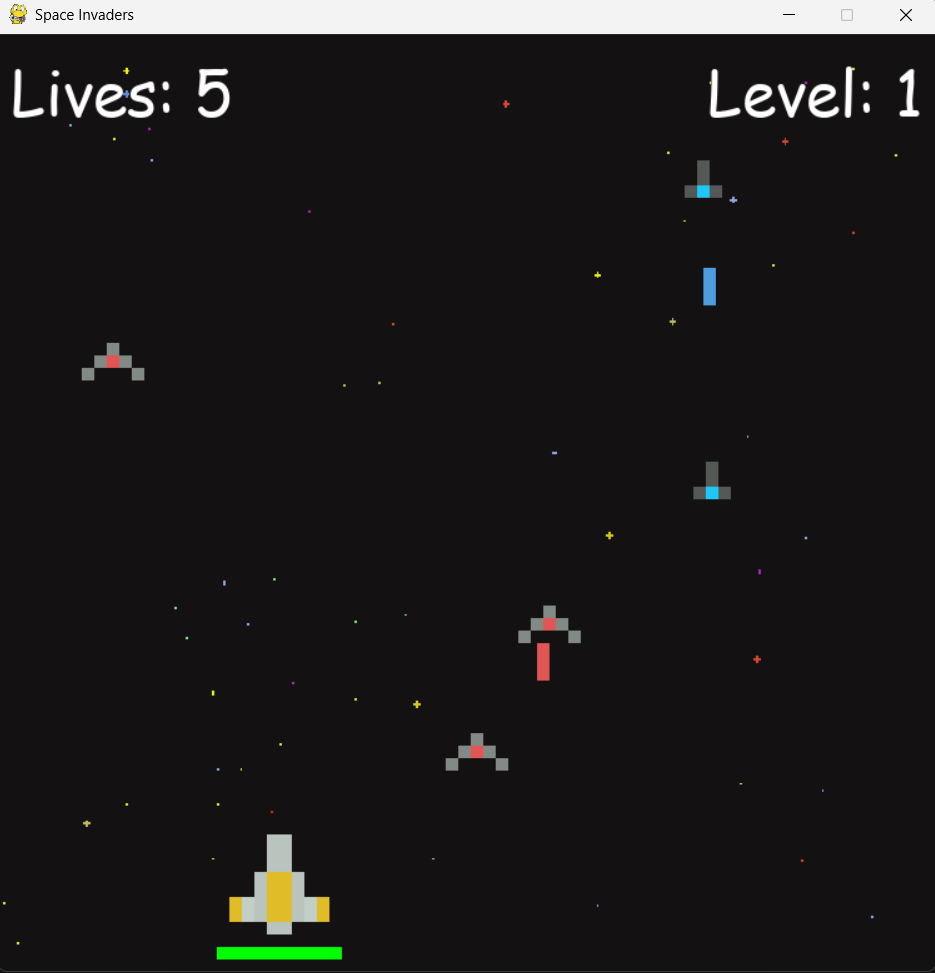

#  Space Invader Game

A **classic arcade-style space shooter** built with **Pygame**, where you control a spaceship, shoot enemy ships, and survive as long as possible.




---

##  Features

1. **Player Controls**: Move left, right, up, and down using **WASD** keys and shoot with **SPACEBAR**.  
2. **Enemy Waves**: Enemies spawn in increasing numbers as you level up.  
3.  **Lasers & Collisions**: Shoot lasers to destroy enemy ships while dodging enemy fire.  
4. **Health & Lives System**: Lose health when hit by enemies; lose lives if enemies pass through.  
5. **Game Over Screen**: Displays a "You Lost" message when all lives are gone.  
6. **Main Menu**: Click the mouse to start the game.  

---

##  Installation & Setup

### **1 Install Python & Pygame**
Make sure you have Python installed. Then, install Pygame:

```sh
pip install pygame
```

### **2 Clone this repository**
```sh
git clone https://github.com/yourusername/space-shooter.git
cd space-shooter
```

### **3 Run the Game**
``` sh
python main.py
```

##  Controls

| Key          | Action      |
|-------------|------------|
| `W`         | Move Up    |
| `A`         | Move Left  |
| `S`         | Move Down  |
| `D`         | Move Right |
| `SPACE`     | Shoot Laser |
| `Mouse Click` | Start Game |


##  Game Mechanics

###  Enemies  
- Enemies spawn in **waves**, increasing as the player progresses.  
- Each enemy randomly **shoots lasers** at the player.  
- If an enemy **collides with the player** or reaches the bottom, the player **loses health/lives**.  

###  Shooting System  
- The player and enemies **shoot lasers**.  
- Lasers **disappear** after going off-screen or hitting a target.  
- **Cool-down system** prevents continuous shooting spam.  

###  Health & Lives  
- The **player starts with 5 lives**.  
- Health **decreases when hit** by enemies.  
- The game **ends when all lives are lost**.  
